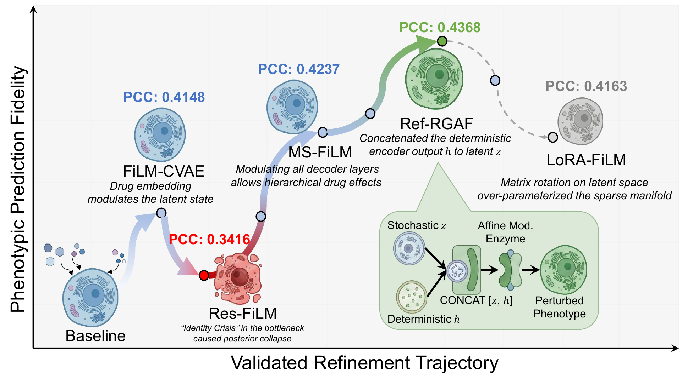

<a id="top"></a>

<div align="center">

<h1>CellScientist</h1>
<h3>Auditable model revision for cellular perturbation prediction</h3>

<p><b>Turn execution feedback into traceable model improvements.</b><br>
A protocol-constrained workflow that links design choices, local revisions and validation outcomes.</p>

<p>
  <a href="pyproject.toml"></a>
  <a href="LICENSE"></a>
  <a href="https://huggingface.co/datasets/Boom5426/CellScientist"></a>
</p>

<p>
  <a href="#quick-start"><b>Quick start</b></a> ·
  <a href="#data"><b>Data</b></a> ·
  <a href="#exploration"><b>Run exploration</b></a> ·
  <a href="#method"><b>Method</b></a> ·
  <a href="#outputs"><b>Inspect outputs</b></a> ·
  <a href="#citation"><b>Cite</b></a>
</p>

</div>

**CellScientist** uses execution and validation feedback to guide local revisions
of cellular perturbation-response models. A fixed task contract protects data
partitions and evaluation semantics, while a persistent history records which
components changed, why they changed and how each candidate performed.

The public implementation provides the **CellScientist controller for four
BBBC036/BBBC047 task settings**, a finite executable candidate space,
reproducibility locks and two operational audits. It produces both a
validation-selected candidate and an inspectable account of its development.

<p align="center">
  <a href="docs/assets/refinement-trajectory.pdf"></a>
  <br>
  <sub>From the manuscript: the BBBC047 model-revision trajectory · <a href="docs/assets/refinement-trajectory.pdf">Vector figure ↗</a></sub>
</p>

The case study illustrates why the retained candidate need not be the last
attempt. Its annotations record working diagnostics during the broader
architecture search. The runnable release below uses the constrained candidate
space described in [Method](#method).

<a id="quick-start"></a>

## 🚀 Quick start

**Python 3.10+.** Clone the repository and install it in an isolated environment:

```bash
git clone https://github.com/limengran98/CellScientist.git
cd CellScientist
python -m venv .venv
source .venv/bin/activate
python -m pip install -e .
python -m cellscientist --help
```

On Windows PowerShell, activate the environment with
`.venv\Scripts\Activate.ps1`. Run the commands below from the repository root.

### Start with the self-contained audits

These registered checks use synthetic contract and component-fault cases;
they require **no dataset download, model training or LLM credentials**.

```bash
python -m cellscientist lca-audit --output audit_outputs/lca_audit.json
python -m cellscientist routing-audit --output audit_outputs/routing_audit.json
```

| Audit | What it checks | Output |
| :--- | :--- | :--- |
| **LCA** | Protected fields, interfaces, outputs, runtime failures and repair budgets | Case-level decisions and summary counts |
| **Routing** | Localization and local repair of 15 registered faults across five component addresses | Per-case routing, repair outcomes and the routing mode used |

Without an LLM configuration, `routing-audit` uses the registered deterministic
top-ranked route. To exercise constrained LLM selection after setting up the
data and endpoint below, pass `--config configs/bbbc036_047_formal.json`.

<a id="data"></a>

## 🧬 Data

**[Download the CellScientist data release on Hugging Face →](https://huggingface.co/datasets/Boom5426/CellScientist)**

The release contains six preprocessed HDF5 files under
[`Cell_Morphology_data/`](https://huggingface.co/datasets/Boom5426/CellScientist/tree/main/Cell_Morphology_data).
The registered code configuration uses the four BBBC files.

| Dataset | Plate split | SMILES split | Current code configuration |
| :--- | :--- | :--- | :--- |
| **BBBC036** | `BBBC036_plate_split.h5` | `BBBC036_smiles_split.h5` | Both settings |
| **BBBC047** | `BBBC047_plate_split.h5` | `BBBC047_smiles_split.h5` | Both settings |
| **CPG0016** | `cpg0016_plate_split.h5` | `cpg0016_smiles_split.h5` | Data available; no registered task in this release |

Download the four BBBC files and arrange them in the directory expected by the
configuration. The download folder and the runtime data folder have different
layouts:

```text
/path/to/bbbc_hdf5/
├── BBBC036/
│   ├── BBBC036_plate_split.h5
│   └── BBBC036_smiles_split.h5
└── BBBC047/
    ├── BBBC047_plate_split.h5
    └── BBBC047_smiles_split.h5
```

Each runtime file must contain a `combined` HDF5 group with `morphology_pre`,
`morphology_post`, `dose`, `smiles`, `plate_id` and `split_id` datasets.
`split_id` assigns folds 1–5. The [`inspect` command](#exploration) validates
the schema and reports partition sizes and group separation.
See [the input specification](data/README.md) for details.

<a id="exploration"></a>

## Run a BBBC exploration

The registered configuration requires **CUDA-enabled PyTorch** and an
OpenAI-compatible chat-completions endpoint. It selects
`gemini-3-pro-preview` in [`configs/bbbc036_047_formal.json`](configs/bbbc036_047_formal.json).
The endpoint must serve that configured model. Backend or model changes define
a different run configuration and require a new lock.

### 1. Set your data and endpoint

```bash
export CELLSCIENTIST_DATA_ROOT=/path/to/bbbc_hdf5
export CELLSCIENTIST_API_BASE=https://your-openai-compatible-endpoint/v1
export CELLSCIENTIST_API_KEY=your_key
```

<details>
<summary><b>Windows PowerShell equivalents</b></summary>

```powershell
$env:CELLSCIENTIST_DATA_ROOT = "C:\data\bbbc_hdf5"
$env:CELLSCIENTIST_API_BASE = "https://your-openai-compatible-endpoint/v1"
$env:CELLSCIENTIST_API_KEY = "your_key"
```

</details>

Credentials are read from environment variables. The repository contains no
endpoint credentials.

### 2. Inspect the inputs and freeze the run

```bash
python -m cellscientist preflight --config configs/bbbc036_047_formal.json
python -m cellscientist inspect --config configs/bbbc036_047_formal.json
python -m cellscientist freeze --config configs/bbbc036_047_formal.json --lock configs/bbbc036_047_formal.lock.json
```

`preflight` reports PyTorch and CUDA availability; the registered exploration
stops if its CUDA backend is unavailable. Add `--check-llm` to `preflight` for
an endpoint health request. `freeze` records the resolved configuration,
source hashes and data-file hashes; formal execution verifies this lock.

### 3. Run one task and seed

```bash
python -m cellscientist run --config configs/bbbc036_047_formal.json --lock configs/bbbc036_047_formal.lock.json --task BBBC036_smiles --seed 11
```

Available task IDs are `BBBC036_plate`, `BBBC036_smiles`, `BBBC047_plate` and
`BBBC047_smiles`. The configuration registers seeds `11, 22, 33, 44, 55` and
a budget of 10 evaluated candidates, with reporting checkpoints at
`1, 3, 5, 10`.

<details>
<summary><b>Run the full registered matrix</b></summary>

After freezing the configuration, run all four tasks and five seeds:

```bash
python -m cellscientist run-matrix --config configs/bbbc036_047_formal.json --lock configs/bbbc036_047_formal.lock.json --jobs 1
```

Alternatively, the Bash wrapper performs preflight, inspection, freezing and
the matrix run in sequence:

```bash
bash scripts/run_exploration.sh
```

Choose `--jobs` according to available GPU memory. The wrapper reads the
equivalent setting from `JOBS`, which defaults to `1`.

</details>

### Keep the evaluation roles explicit

| Data partition | Role |
| :--- | :--- |
| **Folds 1–3** | Fit candidate predictors |
| **Fold 4: feedback subset** | Produce diagnostics that guide the next revision |
| **Fold 4: selection subset** | Score candidates for retention alongside feedback scores |
| **Fold 5** | Report the selected candidates after search |

Fold 4 is deterministically divided into group-disjoint feedback and selection
subsets using the task's plate or SMILES groups. The registered retention rule
maximizes the mean feedback and selection **global PCC**. Reporting uses
fold 5, which does not guide candidate proposals or selection.

<a id="method"></a>

## How CellScientist revises a model

```text
Fixed task contract + recorded history
                   ↓
      Execution and validation diagnostics
                   ↓
       Route to a typed component address
                   ↓
      Apply and check a legal local revision
                   ↓
          Evaluate → record → retain
                   └───────────────↺
```

| Component | Role in the workflow | Implementation |
| :--- | :--- | :--- |
| **HRT — History-Aware Revision Tracking** | Preserve candidate states, component dependencies and transition provenance | [`hrt.py`](cellscientist/hrt.py), [`runner.py`](cellscientist/runner.py) |
| **LCA — Limited-Change Application** | Check protected task semantics and admissible local changes | [`schemas.py`](cellscientist/schemas.py), [`search_space.py`](cellscientist/search_space.py), [`lca_audit.py`](cellscientist/lca_audit.py) |
| **PDR — Performance-Discrepancy Refinement** | Use diagnostics and history to choose the component to revise | [`controllers.py`](cellscientist/controllers.py), [`routing_audit.py`](cellscientist/routing_audit.py) |

The public controller addresses **conditioning, target, representation,
decoder and regularization** within a 768-candidate space. Candidates specify
input conditioning, direct or delta targets, input and output projection
dimensions, and regularization strength. The LLM selects from permitted
address–candidate pairs; deterministic code realizes the proposed local change.

The release exposes this constrained CellScientist controller and its two
audits. The manuscript also studies broader task-specific architecture searches
and additional response spaces; those experiments have separate protocols and
are not all exposed by this command-line interface.

<a id="outputs"></a>

## Inspect the trajectory and selected candidate

Runs are saved under the configured output root:

```text
outputs/exploration/<task>/standard_h0/cellscientist/seed-<seed>/
├── run_manifest.json   # Protocol, source and runtime provenance
├── run_result.json     # Selection, metrics, checkpoints, HRT and trajectory
└── llm_trace.jsonl     # Recorded LLM requests and responses, when present
```

Failed runs write `run_failure.json`. Fitted-candidate caching uses
`outputs/cache/` by default. To inspect the example run:

```python
import json
from pathlib import Path

path = Path(
    "outputs/exploration/BBBC036_smiles/standard_h0/"
    "cellscientist/seed-11/run_result.json"
)
result = json.loads(path.read_text(encoding="utf-8"))
print("Selected candidate:", result["selected_candidate_id"])
print("Held-out metrics:", result["test_metrics"])
print("Evaluated candidates:", result["evaluated_candidates"])
```

`trajectory` records successive candidates and feedback;
`hrt` records the protected task state and component history;
`budget_checkpoints` reports retained candidates at the registered budgets.
Keep these records and the lock together when comparing runs.

<details>
<summary><b>Repository map</b></summary>

```text
cellscientist/   Controller, candidate space, evaluator, provenance and audits
configs/        Registered BBBC036/BBBC047 protocol
data/           Runtime HDF5 schema and input layout
scripts/        Exploration and audit wrappers
docs/assets/    Manuscript trajectory figure for this README
```

Useful entry points: [CLI](cellscientist/cli.py) ·
[data loader](cellscientist/data.py) ·
[protocol and locks](cellscientist/protocol.py) ·
[predictors](cellscientist/models.py) ·
[evaluation](cellscientist/evaluator.py).

</details>

<a id="citation"></a>

## Citation, license and support

CellScientist accompanies **CellScientist: From Execution Feedback to Auditable
Model-Revision Trajectories for Cellular Perturbation Prediction**.
For software use, cite this repository and record the exact commit and run
configuration. The following entry identifies the current software release:

```bibtex
@misc{cellscientist_software,
  author       = {{CellScientist Authors}},
  title        = {{CellScientist}},
  year         = {2026},
  howpublished = {\url{https://github.com/limengran98/CellScientist}},
  note         = {Software, version 1.0.0}
}
```

Cite the original datasets used in your analysis as well. Code is released
under the [MIT License](LICENSE). The companion
[Hugging Face data card](https://huggingface.co/datasets/Boom5426/CellScientist)
declares Apache-2.0 for that release; consult the source datasets' terms for
the underlying measurements.

For questions or reproducible bug reports,
[open an issue](https://github.com/limengran98/CellScientist/issues) with the
commit, task ID, configuration and relevant error trace.

---

<p align="center">
  <b>A selected model, with an inspectable path to it.</b><br>
  <sub><a href="#top">Back to top ↑</a></sub>
</p>
